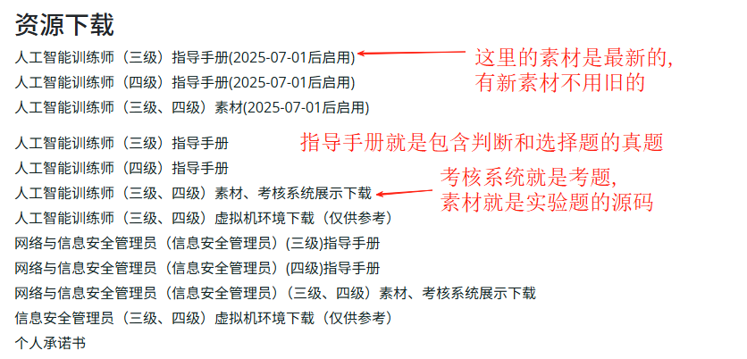

## Intro
上海人工智能训练师全题库，详询jarvanzhao@qq.com

## 素材
最新资源来源: https://gjzs.sjtu.edu.cn/skill

## 客观题课程
6月28日课程录屏，通过网盘分享的文件：链接: https://pan.baidu.com/s/1vJ0FeQhlYU9u87qPnb0SBg?pwd=9tht 
第二天6月29日课程录播：链接: https://pan.baidu.com/s/1YMqBAJf2820tFUDKYoxPsg?pwd=zfew
这是一个模拟考试的平台，给大家使用： https://sh-sict.com/simulation-exam
客观题的答案在 [./操作技能（老版本答案汇总）]

## 主观题课程
### 0715周二20点-22点人工智能7月直播第1次课 
https://xhhyh.mk.xet.citv.cn/sl/1LrZ8x
答案在 [./7月15日]

### 0718周五20点-22点人工智能7月直播第2次课
https://xhhyh.mk.xet.citv.cn/sl/3wiXh5

### 0721周一20点-22点人工智能7月直播第3次课
https://xhhyh.mk.xet.citv.cn/sl/51Pv2