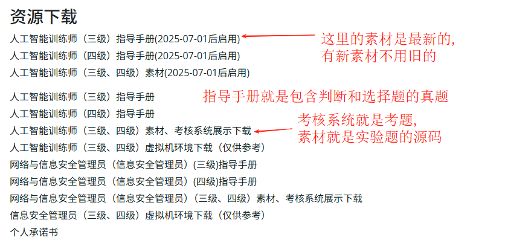

## Intro
上海人工智能训练师全题库，详询jarvanzhao@qq.com

## 素材
最新资源来源: https://gjzs.sjtu.edu.cn/skill

## 程序题课程
### 6月28日课程录屏
https://pan.baidu.com/s/1vJ0FeQhlYU9u87qPnb0SBg?pwd=9tht 
通义听悟分享：
https://tingwu.aliyun.com/doc/transcripts/47z39v2e42lmnedg?sl=1# 《人工智能训练师0628上午》
https://tingwu.aliyun.com/doc/transcripts/dej8nbde2d4b9pog?sl=1# 《人工智能训练师0628下午》

### 第二天6月29日课程录播
链接: https://pan.baidu.com/s/1YMqBAJf2820tFUDKYoxPsg?pwd=zfe
https://tingwu.aliyun.com/doc/transcripts/3kprql7467dg9xgd?sl=1# 《人工智能训练师0629_1》
https://tingwu.aliyun.com/doc/transcripts/2yjoqzdvrd5bn68l?sl=1# 《人工智能训练师0629_2》
https://tingwu.aliyun.com/doc/transcripts/dej8nbde2dg59pog?sl=1# 《人工智能训练师0629_3》
https://tingwu.aliyun.com/doc/transcripts/3kprql7467pj9xgd?sl=1# 《人工智能训练师0629_4》

这是一个模拟考试的平台，给大家使用： https://sh-sict.com/simulation-exam

## 主观题课程
### 0715周二人工智能7月直播第1次课 
https://xhhyh.mk.xet.citv.cn/sl/1LrZ8x
https://tingwu.aliyun.com/doc/transcripts/mloynm2p4yl4qagp?sl=1# 《第1次人工智能主观客观题课0715》

### 0718周五人工智能7月直播第2次课
https://xhhyh.mk.xet.citv.cn/sl/3wiXh5
https://tingwu.aliyun.com/doc/transcripts/2erk9xdmz25jnml8?sl=1# 《第2次人工智能主观客观题课0718》

### 0721周一人工智能7月直播第3次课
https://xhhyh.mk.xet.citv.cn/sl/51Pv2
https://tingwu.aliyun.com/doc/transcripts/372e9or8dak39xb6?sl=1# 《第3次人工智能主观客观题课0721》